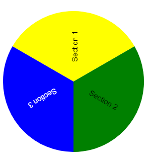

# WheelOfFortune.js

WheelOfFortune.js is a small js library for creating a wheel of fortune.

## Setup
To use WheelOfFortune.js you need to load the WheelOfFortune.min.js. This will provide a WheelOfFortune class. The constructor accepts three or four parameters.

### WheelOfFortune

#### Constructor
```typescript
constructor(rootElement: HTMLElement, _sectionData: SectionData[], _winCallback: (section: SectionnData) => void, config: WheelOfFortuneConfig)
```

|parameter name| type | description | optional |
|-|-|-|-|
|rootElement | HTMLElement | The canvas the wheel woll be draw to. If the element is not an canvas one will be added to the given Element.|no
|_sectionData| SectionData[] | Information about the Sections of the wheel| no
|config| WheelOfFortuneConfig | Advanced display options | yes

#### setWinCallback
Sets a callback function which will be called when the wheel stops spinning.
|parameter name| type | description | optional |
|-|-|-|-|
|_winCallback | (id: number) => void | Function that will be called when the wheel stops spinning. The id is the index of the section in the `_sectionData` array| no

#### spin
spin(minSpeed = 2, maxSpeed = 5)
By calling this function the wheel will start to spin.
|parameter name| type | description | optional |
|-|-|-|-|
|minSpeed|number|minimal rotations per second| yes
|maxSpeed|number|maximal rotations per second| yes

### SectionData
|parameter name| type | description | optional |
|-|-|-|-|
id | number | currently not used but will be a parameter for the `_winCallback` in the future. | no
backgroundColor | string | Any valid css color value | no
text | string | The text that will be displayed in the section | no
textColor | string | Defines color for the text. If no color is specified the text color option from WheelOfFortuneConfig will be used.

### WheelOfFortuneConfig
|parameter name| type | description | optional |
|-|-|-|-|
__stroke__ | |__Stroke configuration__ | __yes__
storke.color | string | stroke color | yes 
stroke.width | number | stroke width | yes
__indicator__ | | __indicator configuration__ | __yes__
indicator.color | string | Defines color for the indicator | yes
indicator.style | 'none' \| 'static'| Defines the type of indicator | no
indicator.width | number | Defines the max width of the indicator. | yes
indicator.height| number | Defines the max width of the indicator. | yes
__pins__ | | __pin configuration__ | __yes__ 
pins.color | string | color of the pins | no 
pins.size | number | radius of the pins | no
pins.margin | number | margin form the circle | no
__text__ || __text configuration__ | __yes__
text.color | string | Default color for texts | no
text.font | string | Font size and family | no
text.size | number | Font size once again for calculations | no


### Example



```HTML
    <canvas id="canvas" height="400px"></canvas>
    <script>
        data = [{
            backgroundColor: 'yellow',
            text: 'Section 1',
            id: 1
        },{
            backgroundColor: 'green',
            text: 'Section 2',
            id: 2
        },{
            backgroundColor: 'blue',
            textColor: 'white',
            text: 'Section 3',
            id: 3
        }]
        let wof = new WheelOfFortune(document.getElementById('canvas'), data, console.log);
    </script>
```

## Build
To build the WheelOfFortune.js you need to run `make build`.
